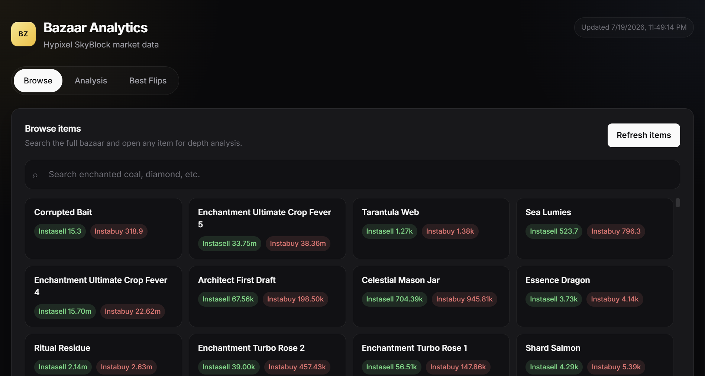

# Bazaar Analytics

Live market analytics for the **Hypixel SkyBlock Bazaar** — browse every item, inspect order-book depth, and find the best flip margins in one place.

**Live site:** [bz-analytics.dev](https://bz-analytics.dev)



---

## Features

### Browse
Search the full bazaar catalog and open any item for analysis. Instasell and Instabuy prices are shown on every card so you can scan opportunities quickly.

### Analysis
Interactive order-book depth chart powered by Plotly:
- Buy bids (green) and sell offers (red) plotted by cumulative volume
- Reference lines for **Instasell** and **Instabuy**
- Volume stats: current orders, weekly moving volume
- Auto-refresh every 30 seconds

### Best Flips
Rank the top 50 items by margin with configurable filters:
- Sort by absolute margin or margin %
- Minimum weekly volume slider (log-scaled)
- Click any row to jump straight into analysis

---

## Price definitions

All prices come from the [Hypixel Bazaar API](https://api.hypixel.net/v2/skyblock/bazaar). No API key required.

| Term | Meaning | Source |
|------|---------|--------|
| **Instasell** | Price you get if you instantly sell | `max(sell_summary)` — highest sell offer |
| **Instabuy** | Price you pay if you instantly buy | `min(buy_summary)` — lowest buy bid |
| **Margin** | Spread between the two | `Instabuy − Instasell` |
| **Margin %** | Margin relative to Instasell | `(Margin / Instasell) × 100` |

**Example — Enchanted Coal**

| | Value |
|---|------:|
| Instasell | 1,456.1 |
| Instabuy | 1,524.0 |
| Margin | 67.9 |

---

## Quick start

No build step. The app is a static site in `public/`.

### Local preview

```bash
# Option 1: any static file server
npx serve public

# Option 2: Wrangler (matches Cloudflare Pages)
npm install
npx wrangler pages dev public
```

Open `http://localhost:8788` (Wrangler) or whatever port your server prints, then click **Load items**.

---

## Deployment

Hosted on **Cloudflare Pages**. The build output directory is `./public` (configured in `wrangler.jsonc`).

```bash
npm install
npx wrangler pages deploy public
```

Or connect the GitHub repo to Cloudflare Pages with:
- **Build command:** *(none)*
- **Output directory:** `public`

---

## Project structure

```
bz-analytics-site/
├── demo.png                    # README screenshot
├── public/
│   ├── index.html              # App (HTML, CSS, JS)
│   └── index_files/
│       └── plotly.min.js       # Chart library
├── wrangler.jsonc              # Cloudflare Pages config
├── package.json
└── LICENSE                     # GPL-3.0
```

Everything lives in a single HTML file plus Plotly. There is no bundler, framework, or backend.

---

## Data source

- **Endpoint:** `https://api.hypixel.net/v2/skyblock/bazaar`
- **Refresh:** On demand, or every 30s with auto-refresh enabled
- **Rate limits:** Be reasonable — the public API is shared. This site fetches once per action, not on a tight loop across all items.

Hypixel provides the data; this project is not affiliated with or endorsed by Hypixel.

---

## License

[GNU General Public License v3.0](LICENSE) — Copyright © Wenda Huang

You are free to use, modify, and redistribute this project under the terms of the GPL.
